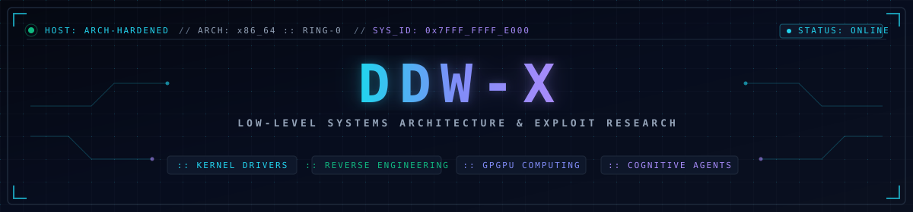

<div align="center">

<!-- Native Standalone Vector Header Banner -->


<br><br>

<a href="https://github.com/DDW-X">
  
</a>

<br>

<!-- Communication Uplinks -->
<div align="center">
  <a href="https://t.me/CONTROLSERVER" target="_blank">
    
  </a>
  &nbsp;&nbsp;
  <a href="mailto:ddw.x.dev@gmail.com">
    
  </a>
  &nbsp;&nbsp;
  <a href="https://github.com/DDW-X" target="_blank">
    
  </a>
</div>

<br>

</div>

<br>

<!-- Kernel Boot Telemetry (dmesg / low-level notation) -->
<details open>
<summary><b><samp>// SYSTEM_BOOT_LOG :: KERNEL_INIT (0x00000000) [CLICK TO TOGGLE]</samp></b></summary>

<br>

```console
[    0.000000] init_kernel() -> 0x00000000 [OK]
[    0.001420] mount_ring0_hooks() -> integrity_verified [IA32_LSTAR hooked]
[    0.002891] bypass_firewall_sandbox() -> ring0_elevation_granted
[    0.004102] v8_isolate_monitor -> flat_heap_engaged [zero_gc_active]
[    0.005814] gpgpu_fbo_pipeline -> eulerian_fluid_compute_ready
[    0.007230] operator_authentication -> identity_confirmed: DDW-X
[    0.008650] primary_specialty -> CNO_ARCHITECT // KERNEL_DRIVERS // HYPERVISOR_DEV
[    0.010112] target_surface -> HARDENED_SYSTEMS // ZERO_DAY_VULN_RESEARCH
[    0.012440] runtime_state -> ALL_SYSTEMS_NOMINAL // LISTENING_FOR_VECTORS
---------------------------------------------------------------------------------------
SYSTEM READY. AWAITING INSTRUCTION REGISTER INPUT...
```

</details>

<br>

<table width="100%" style="border: 0px solid transparent; border-collapse: collapse;">
<tr>
<td width="38%" valign="top" align="center" style="padding-right: 12px;">

<h3 align="center"><samp>// OPERATOR_ID :: DDW-X</samp></h3>


<br><br>

<div align="left" style="font-family: monospace; font-size: 13px;">
<ul>
<li><b>Handle:</b> DDW-X</li>
<li><b>Role:</b> CNO &amp; Systems Architect</li>
<li><b>Location:</b> Shiraz, Fars, Iran</li>
<li><b>Domain:</b> Hypervisors &amp; Kernel Drivers</li>
<li><b>ToolChain:</b> C/C++, ASM, Rust, Ghidra, WinDbg</li>
<li><b>OS:</b> Arch Linux (Hardened)</li>
</ul>
</div>

<br>

<h3 align="center"><samp>// ENCRYPTED_UPLINKS</samp></h3>
<a href="https://t.me/CONTROLSERVER" target="_blank">
  
</a>
<br><br>
<a href="mailto:ddw.x.dev@gmail.com">
  
</a>
<br><br>
<a href="https://github.com/DDW-X" target="_blank">
  
</a>

</td>

<td width="62%" valign="top" style="padding-left: 12px;">

<h3 align="center"><samp>// TELEMETRY_METRICS :: ACTIVITY_TRACE</samp></h3>

<!-- Live Stats & Streak Metrics -->
<div align="center">
  
  <br/><br/>
  
  
</div>

</td>
</tr>
</table>

<br>

<!-- Featured Project Showcase: 4-Tier Elite Research Grid -->
<h2 align="center"><samp>// REPOSITORIES :: CORE_RESEARCH_SHOWCASE</samp></h2>

<table width="100%" style="border: 0px solid transparent; border-collapse: collapse;">
<tr>
<td width="50%" valign="top" style="border: 1px solid #1E293B; padding: 14px; background: #0A101F; border-radius: 8px;">

<div align="center">
  <a href="https://github.com/DDW-X/activetheory.net" target="_blank">
    
  </a>
  <br><br>
  
  
  
  <br><br>
  <div align="left" style="font-family: monospace; font-size: 12.5px; color: #94A3B8; line-height: 1.5;">
    <b>&gt;&gt; Systems Analysis:</b> 1:1 End-to-end architectural reverse engineering, GPGPU compute systems, Eulerian fluid dynamics, and zero-allocation WebGL runtime deep-dive of the Active Theory engine.
  </div>
</div>

</td>

<td width="50%" valign="top" style="border: 1px solid #1E293B; padding: 14px; background: #0A101F; border-radius: 8px;">

<div align="center">
  <a href="https://github.com/DDW-X/abyssal-watcher" target="_blank">
    
  </a>
  <br><br>
  
  
  
  <br><br>
  <div align="left" style="font-family: monospace; font-size: 12.5px; color: #94A3B8; line-height: 1.5;">
    <b>&gt;&gt; Threat Detection:</b> STUXNET-resistant threat detection core in Rust featuring real-time ring-0 hooking, deep kernel telemetry, dynamic cryptography, and SIEM event streaming.
  </div>
</div>

</td>
</tr>

<tr>
<td width="50%" valign="top" style="border: 1px solid #1E293B; padding: 14px; background: #0A101F; border-radius: 8px;">

<div align="center">
  <a href="https://github.com/DDW-X/WebGPU-Stress-PoC" target="_blank">
    
  </a>
  <br><br>
  
  
  
  <br><br>
  <div align="left" style="font-family: monospace; font-size: 12.5px; color: #94A3B8; line-height: 1.5;">
    <b>&gt;&gt; Hardware Stress:</b> Next-generation WebGPU compute shader pipeline for GPU hardware stress analysis, compute shader saturation testing, and zero-overhead memory bandwidth benchmarking.
  </div>
</div>

</td>

<td width="50%" valign="top" style="border: 1px solid #1E293B; padding: 14px; background: #0A101F; border-radius: 8px;">

<div align="center">
  <a href="https://github.com/DDW-X/awesome-agent-skills" target="_blank">
    
  </a>
  <br><br>
  
  
  
  <br><br>
  <div align="left" style="font-family: monospace; font-size: 12.5px; color: #94A3B8; line-height: 1.5;">
    <b>&gt;&gt; Agent Knowledge:</b> Cross-IDE cognitive agent knowledge base transforming leaked frontier prompts into structured, token-efficient Agent Skills, MCP servers, and offensive tooling pipelines.
  </div>
</div>

</td>
</tr>
</table>

<br>

<!-- Technical Arsenal Matrix -->
<h2 align="center"><samp>// CAPABILITY_MATRIX :: TECHNICAL_ARSENAL</samp></h2>
<div align="center">
<p><b><samp>// KERNEL ARCHITECTURE &amp; LOW-LEVEL SYSTEMS</samp></b></p>


<br><br>

<p><b><samp>// GRAPHICS RUNTIME &amp; GPGPU COMPUTE</samp></b></p>


<br><br>

<p><b><samp>// OFFENSIVE CYBER OPERATIONS &amp; REVERSE ENGINEERING</samp></b></p>


<br><br>

<p><b><samp>// AUTOMATION, C2 &amp; INFRASTRUCTURE</samp></b></p>


</div>

<br>

<!-- Contribution Snake Animation Trace -->
<h2 align="center"><samp>// CONTRIBUTION_TRACE :: ACTIVE_RUN</samp></h2>
<div align="center">
<picture>
<source media="(prefers-color-scheme: dark)" srcset="https://raw.githubusercontent.com/DDW-X/DDW-X/output/github-contribution-grid-snake-dark.svg">
<source media="(prefers-color-scheme: light)" srcset="https://raw.githubusercontent.com/DDW-X/DDW-X/output/github-contribution-grid-snake.svg">

</picture>
</div>

<br>

<div align="center">

<br><br>

<br>
<p style="color: #22D3EE; font-family: monospace; font-weight: bold;"><samp>[STATUS: ACTIVE] :: RING-0 INTEGRITY VERIFIED // SESSION SUSTAINED</samp></p>
</div>
